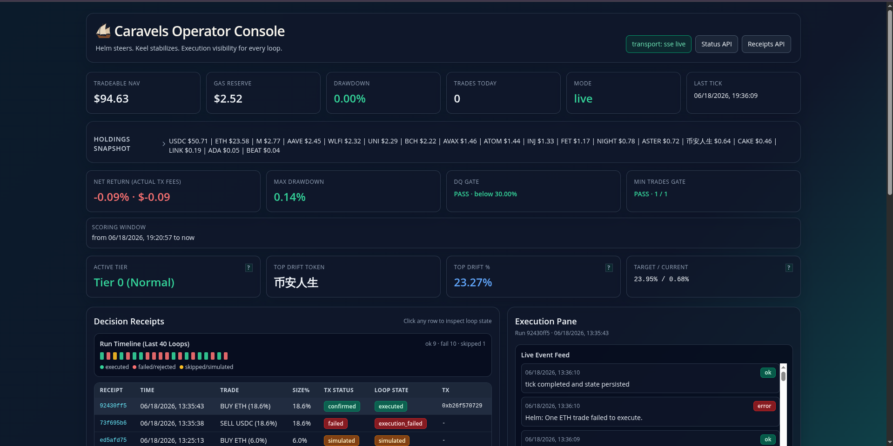
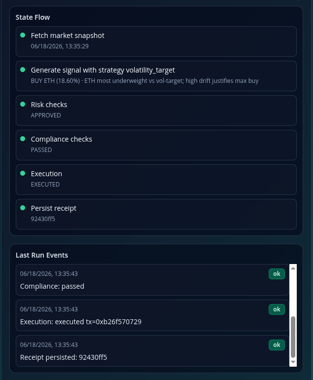
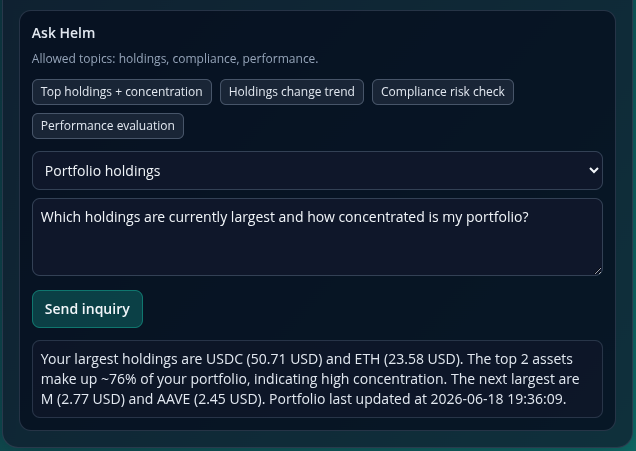

# Caravels

> **Caravels sails the market. Helm steers, Keel keeps it upright.**

An autonomous, self-custodial trading **vessel** for BNB Chain, built for
[BNB Hack: AI Trading Agent Edition ⚡️ CoinMarketCap × Trust Wallet](https://dorahacks.io/hackathon/bnbhack-twt-cmc/detail)
— **Track 1: Autonomous Trading Agents**.

Caravels reads market context from **CoinMarketCap Agent Hub**, decides within a
narrow strategy envelope, signs and executes **self-custodially through the Trust
Wallet Agent Kit (TWAK)**, and writes an auditable **decision receipt** for every
action — executed or rejected.

It is not "an AI that guesses trades." It is a **guardrailed autonomous trader**
you can leave running through the full competition week without it becoming a
black box.

Live bot address: [0xfF802A9C9fb35574267B71E2Df3E34283e6c70d2](https://app.uniswap.org/portfolio/0xfF802A9C9fb35574267B71E2Df3E34283e6c70d2?chain=bnb)

## Demo Video

[](https://www.youtube.com/watch?v=JYbYdALxhH8)

---

## Why Caravels

Most AI trading agents are impressive in a demo and terrifying in production.
They act like black boxes, break self-custody, or ignore the operational rules
that matter in live trading. Track 1 is not a prompt contest — it is a live
trading competition judged on **real PnL under a drawdown cap, with a minimum
trade cadence and realistic transaction costs**.

The real problem is therefore:

> Can an agent trade autonomously for a full week, preserve self-custody, stay
> inside risk limits, satisfy competition rules, and still produce returns?

Caravels is designed around exactly those realities:

- **Self-custodial** — keys stay local; TWAK is the *sole* signer and executor.
  No custodial relay anywhere in the loop.
- **Autonomous** — a hands-off scheduler loop runs the full
  data → decide → guard → execute → record cycle on an interval.
- **Guardrailed** — every candidate passes per-trade caps, exposure caps,
  slippage caps, concentration limits, cooldowns, a drawdown gate, and an
  emergency pause before it can touch the chain.
- **Auditable** — a `DecisionReceipt` is persisted for every proposed action,
  with the market snapshot, signal rationale, risk verdict, compliance result,
  TWAK request reference, tx hash, and post-trade portfolio state.

---

## The vessel: Helm and Keel

Caravels has two named subsystems. Every trade is the product of both.

```
        CoinMarketCap Agent Hub  ──►  market snapshot (prices, RSI, MACD, EMA, F&G, funding)
                                          │
        ┌───────────────────────── HELM (steers) ─────────────────────────┐
        │  signal.py   → reads CMC features, picks a strategy,             │
        │                emits CandidateAction(s) + rationale              │
        │  ladder.py   → grid-informed price ladder (rung prices/sizes)    │
        │  execution.py→ orchestrates the guards, then calls TWAK          │
        │  twak.py     → Trust Wallet Agent Kit: swap / limit orders /     │
        │                portfolio / competition registration             │
        └─────────────────────────────────────────────────────────────────┘
                                          │  every candidate must clear:
        ┌───────────────────────── KEEL (keeps it upright) ───────────────┐
        │  risk.py        → per-trade cap, exposure cap, slippage cap,     │
        │                   concentration, cooldown, drawdown gate         │
        │  compliance.py  → eligible-token check, daily-quota check,       │
        │                   competition-mode + emergency-pause checks      │
        │  competition.py → daily trade counter, drawdown/peak NAV state,  │
        │                   portfolio-floor monitor, registration status   │
        └─────────────────────────────────────────────────────────────────┘
                                          │
                       TWAK signs self-custodially ──►  BNB Chain (BSC) tx
                                          │
                       DecisionReceipt persisted to SQLite (audit trail)
```

- **Helm** — the steering/decision layer: `signal.py`, `ladder.py`,
  `execution.py`, `twak.py`.
- **Keel** — the stability/guardrail layer: `risk.py`, `compliance.py`,
  `competition.py`.

> CMC Agent Hub informs the trade. **Helm** decides the action. **TWAK** signs
> and executes it self-custodially. **Keel** makes sure nothing leaves harbor
> that would capsize the vessel.

---

## Sponsor-stack architecture

| Layer | Tool | Responsibility |
|---|---|---|
| **Data / signals** | CoinMarketCap Agent Hub (MCP) | Market context and pre-computed signals (RSI / MACD / EMA / Fear & Greed / funding), token metadata resolution, optional x402-paid news/sentiment enrichment |
| **Signing + execution** | Trust Wallet Agent Kit (`twak` CLI) | Spot swaps, grid-informed limit orders, portfolio reads, competition registration — all via autonomous Agent-Wallet signing |

TWAK is the single, auditable execution authority — every trade is signed and
settled through it, with no alternate signing path.

---

## Technical implementation

Caravels is a single Python package (`caravels/`) that runs a blocking scheduler
loop. The real modules and what they do:

### Orchestration
- **`__main__.py`** — CLI entry point (`python -m caravels`). Parses flags, sets
  up rotating file + console logging, then launches the loop and/or dashboard.
- **`run.py`** — the main loop (`run_loop`). On boot it opens the DB, seeds the
  token-metadata cache, resolves any missing CMC IDs / BSC addresses, builds the
  CMC / TWAK / LLM adapters, restores competition state, then ticks on an
  interval. Each `_tick` runs: emergency-pause check → CMC snapshot (skip if
  stale) → refresh pending tx receipts → TWAK portfolio → live-score / drawdown
  update → DQ gate → fallback quota trade (if at risk) → Helm signal →
  batched execution → persist competition ops + portfolio.

### Helm (decision + execution)
- **`signal.py`** — unified signal generator. Selects a strategy (or `auto`),
  optionally runs in **agentic tool-calling** mode, and returns one or more
  `CandidateAction`s plus diagnostics. Backed by the strategy registry.
- **`strategies/`** — pluggable strategies behind a registry:
  `momentum_rebalance`, `trend_following`, `mean_reversion`,
  `volatility_target`, `breakout`, and `llm_oneshot`, with shared `guards.py`.
- **`ladder.py`** — pure math: given a center price, spacing, rung count, and
  distribution type, returns rung prices and sizes. Grid-informed laddered
  execution; no I/O, no decisions.
- **`indicators.py` / `regime.py`** — TA-Lib-backed indicators and
  regime/volatility classification used by the strategies.
- **`execution.py`** — Helm's execution coordinator. Runs Keel's risk →
  compliance checks, then calls TWAK (`swap` or `place_limit_orders`),
  reconciles the post-trade portfolio, and builds the receipt. `execute_batch`
  threads the portfolio between sequential swaps.
- **`twak.py`** — the Trust Wallet Agent Kit adapter: `get_portfolio`,
  `swap` / `swap_quote`, `place_limit_orders`, `compete_register`,
  `compete_status`. Falls back to a stub when no TWAK credentials are present so
  the loop is runnable offline.

### Keel (risk + guardrails)
- **`risk.py`** — approves / resizes / rejects a candidate against per-trade cap,
  total risk-on exposure cap, single-token concentration cap, slippage cap,
  cooldown, and the drawdown gate. 
- **`compliance.py`** — eligible-token allowlist check, daily-quota-at-risk
  check, competition-mode and emergency-pause checks.
- **`competition.py`** — stateless ops layer: daily trade counter, peak NAV /
  drawdown tracking, portfolio-floor monitor, registration status, and the
  fallback micro-rebalance trigger.
- **`scoring.py`** — computes the live competition score (net return after
  simulated tx costs, max drawdown, DQ flag, trade count).

### Adapters, data, and audit
- **`cmc.py`** — CoinMarketCap Agent Hub adapter (MCP via API key). Fetches the
  market snapshot, timestamps every pull, flags stale data, resolves token
  metadata, and gates optional x402-paid enrichment. Also called via Agentic Helm Flow.
- **`llm.py`** — provider abstraction (`make_provider`) for **Mistral** or
  **OpenAI**, used by the signal layer.
- **`models.py` / `receipt.py`** — typed `CandidateAction`, `PortfolioState`,
  `MarketSnapshot`, `CompetitionState`, `Score`, and the `DecisionReceipt`
  schema.
- **`tx_confirmation.py`** — refreshes pending receipts by polling tx
  confirmation status.
- **`db.py`** — SQLite (WAL mode) persistence: receipts, portfolio snapshots,
  competition ops, token metadata cache, and the runtime event stream that
  powers the dashboard.

### Configuration model

Two separate concerns, never mixed:

- **`.env`** — secrets, credentials, paths, and runtime flags (API keys, TWAK
  credentials, network, dry-run / competition toggles). Machine-specific, **not
  committed**. See [.env.example](.env.example).
- **`settings.json`** — strategy parameters, Keel risk limits, and the eligible
  token universe. Context-specific and **committed** for reproducibility.
  Override with `CARAVELS_SETTINGS` or `--settings`. Profiles included:
  [settings.json](settings.json), [settings.paper.json](settings.paper.json),
  [settings.competition.json](settings.competition.json).

Run modes (env flags):

| Flag | Effect |
|---|---|
| `CARAVELS_DRY_RUN` | Paper mode — no real trades (single-pass when `--dry-run`) |
| `CARAVELS_SIMULATION_MODE` | All competition rules **except** the registration gate (safe pre-registration paper runs) |
| `CARAVELS_COMPETITION_MODE` | Enforce daily quota + drawdown gate + registration check |
| `CARAVELS_EMERGENCY_PAUSE` | Halt all execution; the loop skips every tick |
| `CARAVELS_LADDER_ENABLED` | Use grid-informed laddered limit orders (requires twak serve --watch, tx reconciliation not fully implemented) |
| `CARAVELS_X402_ENRICH` | Enable optional paid x402 data source enrichment (implemented but disabled by default because of the lack of reliable providers) |

---

## Guardrails (Keel defaults)

Defaults ship in `settings.json` and `RiskLimits`; tune per profile.

| Guardrail | Default |
|---|---|
| Max per-trade notional | 20% of NAV |
| Max risk-on exposure | 50–80% of NAV (profile-dependent) |
| Max single-token exposure | 25–30% of NAV |
| Slippage cap | 1% |
| Max concurrent directional bets | 2 |
| Cooldown between buys of same token | 2–3 ticks |
| Daily soft drawdown warning | 3% |
| Daily hard de-risk | 8% |
| Hard de-risk (reject all risk-on) | 18% |
| Disqualification (DQ) drawdown | 30% |
| Portfolio floor warning | configurable (e.g. $50) |
| Fallback quota trade cost cap | ≤ $5 round-trip |
| Daily-quota cutoff hour (UTC) | 20:00 |

The gap between the 18% hard de-risk and the 30% DQ cap is intentional — it
gives the vessel room to recover after de-risking before hitting the wall.

---

## Token universe

Base **USDC** plus an eligible BEP-20 set. The committed default subset is
**ETH / LINK / CAKE / AVAX**, with a broader eligible registry maintained in
`settings.json`. Every trade candidate is validated against this allowlist by
Keel's compliance check; anything off-list is rejected in competition mode.

Competition contract (BSC mainnet):
[`0x212c61b9b72c95d95bf29cf032f5e5635629aed5`](https://bsctrace.com/address/0x212c61b9b72c95d95bf29cf032f5e5635629aed5)

---

## Install

Requirements: **Python ≥ 3.12**, [`uv`](https://github.com/astral-sh/uv), and
the **TA-Lib** C library (a system dependency of the `ta-lib` Python package).

```bash
# 1. TA-Lib C library (Debian/Ubuntu example)
sudo apt-get install -y build-essential
# (or build from source / use your platform's package manager)

# 2. Python deps
uv sync

# 3. Trust Wallet Agent Kit CLI (self-custodial signer)
curl -fsSL https://agent-kit.trustwallet.com/install.sh | bash
#   then create an app at portal.trustwallet.com/dashboard/apps,
#   paste the Access ID + HMAC Secret, and pick the "Agent Wallet" path.

# 4. Configure
cp .env.example .env
#   fill in: TWAK_ACCESS_ID, TWAK_HMAC_SECRET, CMC_API_KEY,
#            MISTRAL_API_KEY (or OPENAI_API_KEY), NETWORK, etc.
```

Without TWAK / CMC credentials the adapters fall back to stubs, so you can run
the full loop offline in paper mode for development.

---

## Usage

```bash
# Paper / dry-run — single pass, no real trades
python -m caravels --dry-run

# Operator dashboard only (no agent loop)
python -m caravels --dashboard --port 5050

# Live agent loop AND dashboard together
python -m caravels --with-dashboard --port 5050

# Use an alternate settings profile
python -m caravels --settings settings.competition.json

# Verbose logging, console only
python -m caravels --dry-run --log-level DEBUG --no-log-file
```

Competition registration (run once, before the trading window opens):

```bash
python -m scripts.register     # wraps `twak compete register`
```

CLI flags: `--dry-run`, `--dashboard`, `--with-dashboard`, `--settings FILE`,
`--log-level`, `--no-log-file`, `--port` (default `5050`).

The loop interval is `CARAVELS_LOOP_INTERVAL_SECONDS` (env) or
`loop_interval_seconds` in `settings.json`. Stop with `Ctrl-C` — the DB is closed
cleanly.

---

## Observability — the operator dashboard

`python -m caravels --dashboard` (or `--with-dashboard`) serves a Flask app via
Waitress that gives a live, end-to-end view of the vessel. It is how you watch
Helm and Keel work in real time and how a judge verifies the full loop.

What it surfaces:

- **Wallet & registration status** — agent address, NAV, gas reserve,
  competition mode, and on-chain registration state.
- **Holdings & exposure** — current per-token balances and risk-on exposure.
- **Live competition score** — net return after simulated tx costs, max
  drawdown, DQ flag, and daily trade count vs. quota.

  

- **Decision receipts** — the full audit trail: every proposed action with its
  signal rationale, **risk verdict**, **compliance result**, execution status,
  TWAK request reference, and BSC **tx hash**. Rejected trades show their
  rejection reasons — proof the agent is disciplined, not just active.

  

- **Per-token PnL** and **trade history**.
- **Live event stream** — a Server-Sent-Events feed (`/api/stream`) pushes
  runtime events (snapshot fetched, signal generated, execution finished,
  skips, fallbacks) and status/receipt snapshots as they happen.
- **Operator inquiry** — a scoped Q&A endpoint that answers `holdings`,
  `compliance`, and `performance` questions from live state via Agentic Helm (LLM).

  

HTTP/JSON endpoints (handy for demos and scripting):

| Route | Purpose |
|---|---|
| `GET /` | Dashboard UI |
| `GET /api/status` | Wallet, score, drawdown, quota, mode |
| `GET /api/receipts` | Recent decision receipts |
| `GET /api/trades?limit=N` | Recent trades |
| `GET /api/token_pnl` | Per-token PnL |
| `GET /api/stream` | SSE live event + snapshot stream |
| `POST /api/inquiry` | Scoped Q&A (`holdings` \| `compliance` \| `performance`) |
| `GET /api/health` | Health check |

Beyond the dashboard, observability is also persisted: rotating log files
(`caravels.log`, daily rotation, 14-day retention) and the `caravels.db` SQLite
store (receipts, portfolio snapshots, competition ops, runtime events) keep a
complete, replayable record of every voyage.

---

## Project layout

```
caravels/
├── pyproject.toml
├── .env.example                 # secrets / runtime flags template
├── settings.json                # committed strategy + risk + token config
├── settings.paper.json          # paper-run profile
├── settings.competition.json    # competition profile
├── caravels/
│   ├── __main__.py              # CLI entry (python -m caravels)
│   ├── run.py                   # main scheduler loop + tick pipeline
│   ├── config.py                # AppConfig, RiskLimits, ELIGIBLE_TOKENS
│   ├── signal.py                # Helm: strategy selection → CandidateAction(s)
│   ├── strategies/              # Helm: pluggable strategies + registry
│   ├── ladder.py                # Helm: grid-informed price ladder math
│   ├── indicators.py / regime.py# TA-Lib indicators + regime classification
│   ├── execution.py             # Helm: guards → TWAK → receipt
│   ├── twak.py                  # TWAK adapter (swap / limit / portfolio / register)
│   ├── risk.py                  # Keel: risk gates
│   ├── compliance.py            # Keel: eligibility + quota checks
│   ├── competition.py           # Keel: competition ops state
│   ├── scoring.py               # live competition score
│   ├── cmc.py                   # CMC Agent Hub adapter (MCP + x402)
│   ├── llm.py                   # Mistral / OpenAI provider abstraction
│   ├── models.py / receipt.py   # typed models + DecisionReceipt
│   ├── tx_confirmation.py       # pending-receipt confirmation refresh
│   ├── db.py                    # SQLite (WAL) persistence + event stream
│   ├── app.py                   # operator dashboard (Flask)
│   ├── templates/ · static/     # dashboard UI
├── scripts/
│   └── register.py              # one-shot competition registration
├── track2/                      # Track 2: strategy-skill deliverable
└── tests/
```

---

## Demo flow

The strongest demo shows both autonomy **and** restraint:

1. Show the registered agent wallet and the competition contract.
2. Show the strategy config and Keel guardrails (`settings.json`).
3. Show a CMC-driven candidate forming in the live event stream.
4. Show Keel's risk + compliance approval.
5. Show TWAK signing and autonomous execution → BSC **tx hash**.
6. Show the updated portfolio and the decision receipt.
7. Show a **second** trade that Keel **blocks**, with rejection reasons.

> **Caravels sails the market. Helm steers, Keel keeps it upright.**

---

## Diagrams

There are three views of the main loop that could simplify the understanding of the Caravels process: 
[loop-state.svg](images/loop-state.svg) state machine diagram, [loop-flow.svg](images/loop-flow.svg) flow diagram and [loop-sequence.svg](images/loop-sequence.svg) sequence diagram. 

### State Diagram



## License

Released under the [MIT License](LICENSE).
