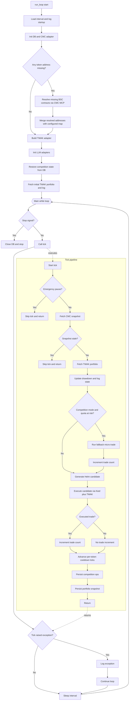
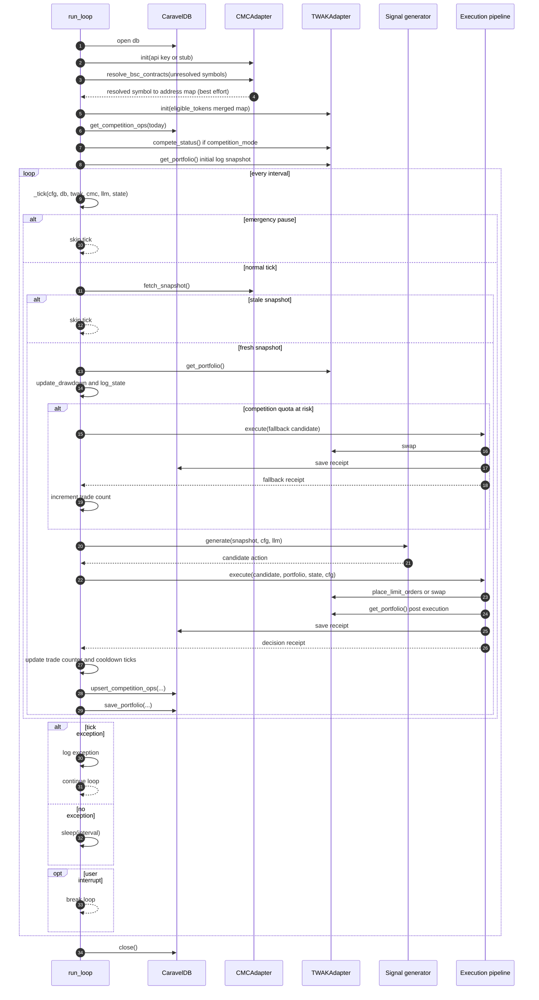
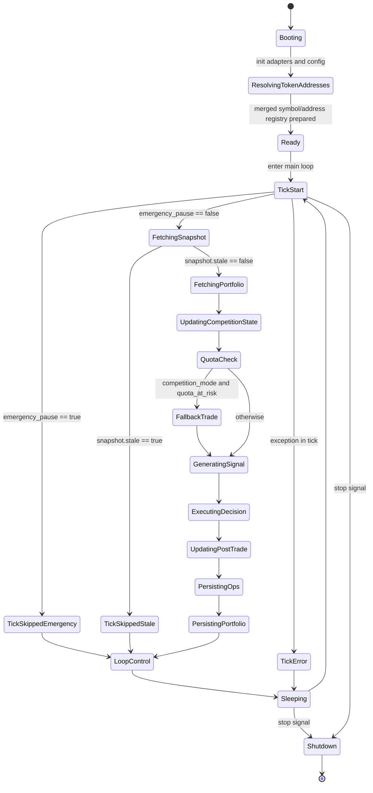

# Caravels Bot Run Loop Diagrams

## Flowchart

```mermaid
flowchart TD
    A[run_loop start] --> B[Load interval and log startup]
    B --> C[Init DB and CMC adapter]
    C --> D{Any token address missing?}
    D -- Yes --> E[Resolve missing BSC contracts via CMC MCP]
    E --> F[Merge resolved addresses with configured map]
    D -- No --> G[Build TWAK adapter]
    F --> G[Build TWAK adapter]
    G --> H[Init LLM adapters]
    H --> J[Restore competition state from DB]
    J --> K[Fetch initial TWAK portfolio and log]
    K --> L{{Main while loop}}

    L --> KI{Stop signal?}
    KI -- Yes --> W[Close DB and stop]
    KI -- No --> M[Call tick]
    M --> N{Tick raised exception?}
    N -- Yes --> O[Log exception]
    O --> R[Continue loop]
    N -- No --> V[Sleep interval]
    V --> L
    R --> V
    W[Close DB and stop]

    subgraph Tick pipeline
        M1[Start tick] --> M2{Emergency pause?}
        M2 -- Yes --> M3[Skip tick and return]
        M2 -- No --> M4[Fetch CMC snapshot]
        M4 --> M5{Snapshot stale?}
        M5 -- Yes --> M6[Skip tick and return]
        M5 -- No --> M7[Fetch TWAK portfolio]
        M7 --> M8[Update drawdown and log state]
        M8 --> M9{Competition mode and quota at risk?}
        M9 -- Yes --> M10[Run fallback micro trade]
        M10 --> M11[Increment trade count]
        M9 -- No --> M12[Generate Helm candidate]
        M11 --> M12
        M12 --> M13[Execute candidate via Keel plus TWAK]
        M13 --> M14{Executed trade?}
        M14 -- Yes --> M15[Increment trade count]
        M14 -- No --> M16[No trade increment]
        M15 --> M17[Advance per-token cooldown ticks]
        M16 --> M17
        M17 --> M18[Persist competition ops]
        M18 --> M19[Persist portfolio snapshot]
        M19 --> M20[Return]
    end

    M -. executes .-> M1
    M20 -. returns .-> N
```

## Sequence Diagram

```mermaid
sequenceDiagram
    autonumber
    participant Scheduler as run_loop
    participant DB as CaravelDB
    participant CMC as CMCAdapter
    participant TWAK as TWAKAdapter
    participant Helm as Signal generator
    participant Exec as Execution pipeline

    Scheduler->>DB: open db
    Scheduler->>CMC: init(api key or stub)
    Scheduler->>CMC: resolve_bsc_contracts(unresolved symbols)
    CMC-->>Scheduler: resolved symbol to address map (best effort)
    Scheduler->>TWAK: init(eligible_tokens merged map)
    Scheduler->>DB: get_competition_ops(today)
    Scheduler->>TWAK: compete_status() if competition_mode
    Scheduler->>TWAK: get_portfolio() initial log snapshot

    loop every interval
        Scheduler->>Scheduler: _tick(cfg, db, twak, cmc, llm, state)

        alt emergency pause
            Scheduler-->>Scheduler: skip tick
        else normal tick
            Scheduler->>CMC: fetch_snapshot()
            alt stale snapshot
                Scheduler-->>Scheduler: skip tick
            else fresh snapshot
                Scheduler->>TWAK: get_portfolio()
                Scheduler->>Scheduler: update_drawdown and log_state

                alt competition quota at risk
                    Scheduler->>Exec: execute(fallback candidate)
                    Exec->>TWAK: swap
                    Exec->>DB: save receipt
                    Exec-->>Scheduler: fallback receipt
                    Scheduler->>Scheduler: increment trade count
                end

                Scheduler->>Helm: generate(snapshot, cfg, llm)
                Helm-->>Scheduler: candidate action

                Scheduler->>Exec: execute(candidate, portfolio, state, cfg)
                Exec->>TWAK: place_limit_orders or swap
                Exec->>TWAK: get_portfolio() post execution
                Exec->>DB: save receipt
                Exec-->>Scheduler: decision receipt

                Scheduler->>Scheduler: update trade counter and cooldown ticks
                Scheduler->>DB: upsert_competition_ops(...)
                Scheduler->>DB: save_portfolio(...)
            end
        end

        alt tick exception
            Scheduler->>Scheduler: log exception
            Scheduler-->>Scheduler: continue loop
        else no exception
            Scheduler->>Scheduler: sleep(interval)
        end

        opt user interrupt
            Scheduler-->>Scheduler: break loop
        end
    end

    Scheduler->>DB: close()
```

## State Diagram

```mermaid
stateDiagram-v2
    [*] --> Booting

    Booting --> ResolvingTokenAddresses: init adapters and config
    ResolvingTokenAddresses --> Ready: merged symbol/address registry prepared

    Ready --> TickStart: enter main loop

    TickStart --> TickSkippedEmergency: emergency_pause == true
    TickSkippedEmergency --> LoopControl

    TickStart --> FetchingSnapshot: emergency_pause == false
    FetchingSnapshot --> TickSkippedStale: snapshot.stale == true
    TickSkippedStale --> LoopControl

    FetchingSnapshot --> FetchingPortfolio: snapshot.stale == false
    FetchingPortfolio --> UpdatingCompetitionState
    UpdatingCompetitionState --> QuotaCheck

    QuotaCheck --> FallbackTrade: competition_mode and quota_at_risk
    FallbackTrade --> GeneratingSignal
    QuotaCheck --> GeneratingSignal: otherwise

    GeneratingSignal --> ExecutingDecision
    ExecutingDecision --> UpdatingPostTrade
    UpdatingPostTrade --> PersistingOps
    PersistingOps --> PersistingPortfolio
    PersistingPortfolio --> LoopControl

    LoopControl --> Sleeping
    Sleeping --> TickStart
    Sleeping --> Shutdown: stop signal
    TickStart --> Shutdown: stop signal

    TickStart --> TickError: exception in tick
    TickError --> Sleeping

    Shutdown --> [*]
```
